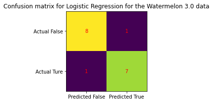

# Tutorial 2 
## Contents
1. [Importing Packages, Functions & Classes](#step-1-import-packages-functions-and-classes)
2. [EDA,](#step-2-get-data-and-transform-the-columns) [Feature Engineering, Plotting ](#feature-engineering) & [Scaling Data](#scaling-data)
3. [Creating a Model & Train It(Logistic Regression)](#step-3-create-a-model-and-train-it-logistic-regression)
4. [Evaluate the Model](#step-4-evaluate-the-model)
5. [Improve the Model](#step-5-improve-the-model)
6. [Plot the Model](#step-6-plot-the-model)


## Step 1: Import Packages, Functions, and Classes
The following line of codes import the necessary packages functions and classes for this exercise. 

```
globals().clear()

import pandas as pd
import matplotlib.pyplot as plt
import numpy as np
from sklearn.linear_model import LogisticRegression
from sklearn.metrics import accuracy_score, confusion_matrix, classification_report
from sklearn.discriminant_analysis import LinearDiscriminantAnalysis

import os
```

## Step 2: Get Data and transform the columns
### Exploratory Data Analysis
1. Change the working directory to your current directory, preferably where all the csv files are also available, so that when you type in pathname, you don't have to type in the whole directory!
```
os.chdir("/Users/adhitchandy/Library/CloudStorage/OneDrive-M365UniversitätHamburg/Semester 4/Machine Learning/Tutorial")
```
Reading any csv file using `pd.read_csv(pathname)` works usually. But here since the encoding of the csv file is not the default `UTF-8`, but `UTF-16` we have to specify the econding mechanism to open the file properly, otherwise it return NaNs. 

```
df=pd.read_csv("watermelon_3_1.csv", encoding='utf-16le')
```
In Python's pandas library, when you use `df.shape` to get the dimensions of a DataFrame, shape is an __attribute__ of the DataFrame object df. The .shape attribute returns a tuple representing the dimensions of the DataFrame, where the first element of the tuple is the number of rows and the second is the number of columns.

```
print(f'The shape of the dataframe is {df.shape}')
print(df.columns.to_list())
```

2. Check for any null values:  
The following code tells you how many non-missing values exist in each column where at least one column in the row has a missing value. If you are analyzing data quality or data completeness, this information helps identify which columns in your potentially problematic rows are most often complete.
```
print(df[df.isnull().any(axis=1)].count())
```
The code df[df.isnull().any(axis=1)].count() is used in pandas to perform a couple of specific operations regarding the handling of missing data. Here's a step-by-step breakdown of what each part of this expression does and the overall result:

- `df.isnull()`: This method returns a DataFrame of the same shape as df, where each element is True if the corresponding element in df is NaN or null, and False otherwise.
- `any(axis=1)`: This is applied to the DataFrame returned by df.isnull(). It checks each row to determine if there's at least one True value in that row (i.e., if there's at least one null value in that row). The result is a Series of boolean values where each value corresponds to a row in df. The value is True if there's at least one NaN in the row, and False otherwise.
- `df[df.isnull().any(axis=1)]`: This uses the boolean Series to filter the original DataFrame df. It selects only those rows where the Series has True values, meaning it selects rows that contain at least one NaN.
- `count()`: This method is applied to the DataFrame that has been filtered to include only rows with one or more NaN values. It counts the non-null values in each column of this filtered DataFrame. Unlike methods like sum() which would add up values, count() tells you how many entries in each column are not null among the rows that were selected because they have at least one null.

*Another way to check for null values would be: `print(df.isnull().sum())` and this would give a df in which it says how many values are `NaN` in each column.*

3. Rewriting the existing dataframe with a new dataframe so that the rows (`axis=0`) with `any` null values are dropped. 
```
df = df.dropna(how='any',axis=0) 
```

4. Check for class imbalance:

```
print(df['ripe'].value_counts())
```

5. Summary stats of data.
```
print(df.info())
print(df.iloc[:,1:].describe())  # only summary stats for numeric columns
```
The `print(df.info())` command in pandas is used to display a concise summary of a DataFrame. Here’s what happens when you execute this command:

1. **Method Execution**: `df.info()` is called on the DataFrame `df`. This method returns information about the DataFrame including:
   - The class type (`DataFrame`)
   - Index range (including the number of entries)
   - Column names and count
   - The number of non-null values in each column
   - The datatype of each column
   - The memory usage of the DataFrame

2. **Printing the Output**: While `df.info()` itself prints the information to the console by default, wrapping it in `print()` is generally redundant because `df.info()` does not return anything; it directly prints the output. However, some environments might handle standard output differently, so `print(df.info())` might be used to ensure compatibility or to handle a specific scenario in scripted or embedded Python environments.

Here’s a typical output of `df.info()`:

```
<class 'pandas.core.frame.DataFrame'>
RangeIndex: 5 entries, 0 to 4
Data columns (total 3 columns):
 #   Column        Non-Null Count  Dtype  
---  ------        --------------  -----  
 0   ID            5 non-null      int64  
 1   Name          5 non-null      object 
 2   Age           5 non-null      float64
dtypes: float64(1), int64(1), object(1)
Memory usage: 248.0+ bytes
```

**Key Details in the Output:**
- **Class Type**: Shows that the object is a DataFrame.
- **Index Range**: Indicates the range of index labels.
- **Columns**:
  - Shows each column with its position, name, count of non-null data, and data type.
- **Dtypes**: Lists the data types present in the DataFrame.
- **Memory Usage**: Indicates the amount of memory the DataFrame is using.

The `info()` method is very useful for getting a quick overview of the DataFrame, especially to check for data completeness and data types, which helps in preprocessing and cleaning data.

The command `print(df.iloc[:,1:].describe())` in pandas performs a detailed statistical summary of the DataFrame `df`, excluding the first column. Let’s break down the command:

1. **Indexing with `iloc`**: 
   - `df.iloc[:, 1:]` uses the `iloc` indexer to select all rows (`:`) and all columns starting from the second column (`1:`) to the end. This effectively slices the DataFrame to exclude the first column.

2. **Describing the Data**:
   - `describe()` is a method that provides descriptive statistics that summarize the central tendency, dispersion, and shape of a dataset's distribution, excluding `NaN` values. By default, it includes only numerical columns unless the DataFrame consists entirely of categorical data or a mix of numeric and categorical data, in which case `describe()` will include summaries for categorical data as well.

3. **Printing the Output**: 
   - Wrapping `df.iloc[:,1:].describe()` in `print()` ensures that the output is printed out neatly. While calling `.describe()` alone in an interactive environment like a Jupyter notebook automatically formats the output nicely, using `print()` can be necessary in script-based environments to explicitly display the output.

**What Does `describe()` Return?**

The `.describe()` method typically returns the following statistics:
- **count**: The number of non-null entries.
- **mean**: The mean of the entries.
- **std**: Standard deviation, a measure of the dispersion of the dataset.
- **min**: The minimum value.
- **25% (first quartile)**: The value below which 25% of the data falls.
- **50% (median, second quartile)**: The median value of the dataset.
- **75% (third quartile)**: The value below which 75% of the data falls.
- **max**: The maximum value.

For example, if your DataFrame has several numerical columns from the second column onwards, the output will look something like this:

```plaintext
               Age        Salary
count   100.000000    100.000000
mean     35.500000  55000.000000
std      10.388303   5000.000000
min      20.000000  45000.000000
25%      27.750000  51000.000000
50%      35.500000  55000.000000
75%      43.250000  59000.000000
max      50.000000  65000.000000
```

This provides a quick and useful summary of the data, highlighting key trends and outliers, and is especially helpful for initial exploratory data analysis.

### Feature Engineering
```python
cat_cols = df.select_dtypes('object').columns.to_list()
num_cols = df.select_dtypes('float').columns.to_list()
```
`cat_cols = df.select_dtypes('object').columns.to_list()` creates a list named cat_cols that contains the names of all columns in df whose data type is object. This is particularly useful when you need to perform operations specifically on categorical data, such as encoding these categories into numbers for machine learning purposes, filtering, or specific data manipulations involving text.
```python
#filter categoricals variables from df which only contain two different values
df_cat = df.select_dtypes(include=['object']) #subset all the columns with data type object
cat_cols_2_vals = df_cat.nunique() 
cat_cols_2_vals = cat_cols_2_vals[cat_cols_2_vals == 2].index.to_list()
```
Let's break down the code step by step:

- **Step 1:** Selecting Categorical Columns
```python
df_cat = df.select_dtypes(include=['object'])
```
- **`df.select_dtypes(include=['object'])`**: This method is used to filter the DataFrame to include only columns of specific data types, in this case, 'object'. Typically, 'object' datatype in pandas is used for columns that contain text or mixed types but is often used for categorical data.
- **`df_cat`**: This new DataFrame now contains only the columns from `df` that are of type 'object'.

- **Step 2:** Counting Unique Values in Each Column
```python
cat_cols_2_vals = df_cat.nunique()
```
- **`df_cat.nunique()`**: This function calculates the number of unique values in each column of the DataFrame `df_cat`. The result is a Series where the index corresponds to the column names and the values are the counts of unique entries in those columns.

- **Step 3:** Filtering Columns with Exactly Two Unique Values
```python
cat_cols_2_vals = cat_cols_2_vals[cat_cols_2_vals == 2].index.to_list()
```
- **`cat_cols_2_vals == 2`**: This condition checks which entries in the Series `cat_cols_2_vals` are equal to 2, meaning the columns that have exactly two unique values.
- **`.index.to_list()`**: After filtering the Series to retain only the columns with exactly two unique values, this part retrieves the names of these columns by accessing the index of the filtered Series and then converting it to a list.

**What Does This Achieve?**
The final output stored in the variable `cat_cols_2_vals` is a list of column names from the original DataFrame `df` that are categorical (of type 'object') and have exactly two unique values. This can be particularly useful in scenarios like binary classification tasks in machine learning, where you might need to handle binary features differently, such as converting them into a format that a model can understand (e.g., using 0/1 encoding).

- **Example Usage:**
Here’s a brief example to demonstrate this:
```python
import pandas as pd

# Example DataFrame
data = {
    'Gender': ['Male', 'Female', 'Male', 'Female'],
    'City': ['New York', 'Los Angeles', 'New York', 'Miami'],
    'Status': ['Single', 'Married', 'Married', 'Single']
}

df = pd.DataFrame(data)

# Filtering object-type columns with exactly two unique values
df_cat = df.select_dtypes(include=['object'])
cat_cols_2_vals = df_cat.nunique()
cat_cols_2_vals = cat_cols_2_vals[cat_cols_2_vals == 2].index.to_list()

# Output the result
print(cat_cols_2_vals)
```

The output will be:
```plaintext
['Gender', 'Status']
```
These columns ('Gender' and 'Status') each have exactly two distinct values and can be used accordingly in further data processing or analysis tasks.

```python
cat_cols = set(cat_cols) ^ set(cat_cols_2_vals)  # find not intersected elements
```
- **Step 1:** Convert Lists to Sets
- **`set(cat_cols)`** and **`set(cat_cols_2_vals)`**: These convert the lists `cat_cols` and `cat_cols_2_vals` into sets. Sets in Python are collections of unique elements and support mathematical operations like unions, intersections, and differences.

- **Step 2:** Symmetric Difference Operation
- **`^`** (caret symbol) is the operator for symmetric difference between two sets. The symmetric difference between two sets is the set of elements that are in either of the sets, but not in their intersection. In simpler terms, it includes elements from both sets that are not common to both.

**Practical Meaning:**
If `cat_cols` contains the names of all columns that were identified as categorical (i.e., columns of type 'object') and `cat_cols_2_vals` contains the names of categorical columns with exactly two unique values, then using the symmetric difference operation (`^`) will result in a set of column names with more or less than two unique values (present in `cat_cols` but not in `cat_cols_2_vals`).  
This operation is particularly useful when you need to segregate categorical columns based on their properties (like number of unique values) for specific preprocessing steps in data analysis or machine learning workflows.

### Extract prediction labels
```python
labels = df['ripe'].unique().tolist()

for col in cat_cols:
    df = pd.concat([df.drop(col, axis=1), pd.get_dummies(df[col], prefix=col)], axis=1)
```
The code provided performs two main operations on a pandas DataFrame `df`. It first extracts unique values from a column named `'ripe'` and then manipulates the DataFrame by converting categorical columns into dummy/one-hot encoded columns. Let’s break down the operations:

**Step 1:** Extracting Unique Values from a Column
```python
labels = df['ripe'].unique().tolist()
```
- **`df['ripe'].unique()`**: This extracts the unique values from the column named `'ripe'` in the DataFrame `df`. The `unique()` function returns a numpy array of all unique values in the specified column.
- **`.tolist()`**: This converts the array of unique values into a Python list. The resulting list, `labels`, contains all unique values that appear in the `'ripe'` column.

**Step 2:** Transforming Categorical Columns into Dummy Variables
```python
for col in cat_cols:
    df = pd.concat([df.drop(col, axis=1), pd.get_dummies(df[col], prefix=col)], axis=1)
```
- **Loop Over `cat_cols`**: The loop iterates over each column name stored in the list `cat_cols`. These are presumably the names of categorical columns that you want to transform into dummy variables.
- **`df.drop(col, axis=1)`**: Inside the loop, this method removes the current column (`col`) from `df`. The `axis=1` parameter specifies that columns (not rows) should be dropped.
- **`pd.get_dummies(df[col], prefix=col)`**: This function converts the categorical column into dummy/one-hot encoded columns. For each unique value in the column, a new binary column is created. The `prefix=col` argument adds the original column name as a prefix to each new dummy column name to maintain clarity on what the dummy columns represent.
- **`pd.concat([...], axis=1)`**: This concatenates two DataFrames along `axis=1` (i.e., horizontally). It combines the DataFrame with the dropped column and the newly created dummy columns into a single DataFrame.
- **Assignment to `df`**: The result of the concatenation is assigned back to `df`, updating it with the transformed data.

**Important Note**
- The loop reassigns `df` in every iteration, which could be computationally expensive for large DataFrames. It's more efficient to prepare transformations and then apply them all at once if possible.
- You also have to ensure that `cat_cols` does not contain the column `'ripe'` if you still need it for other operations because it might get modified or dropped in the process. 

### BOOLEAN TYPE FEATURES (YES /NO)
```python
for col in cat_cols_2_vals:
    df[col + '_new'] = df[col].apply(lambda x: 1 if x == 'hard' else 0)
    df.drop(col, axis=1, inplace=True)

print(df.info())
```
The code snippet provided transforms specific categorical columns in a pandas DataFrame by creating new columns based on the values in these categorical columns, and then it removes the original columns. Here's a detailed breakdown of what each line in this loop does:

**Create New Columns Based on Condition**
```python
df[col + '_new'] = df[col].apply(lambda x: 1 if x == 'hard' else 0)
```
- **`df[col + '_new']`**: This creates a new column in `df` with the name of the original column plus the suffix `_new`.
- **`df[col].apply(lambda x: 1 if x == 'hard' else 0)`**: This line applies a function to each element in the column named `col`. The function uses a lambda expression that checks if the value `x` is `'hard'`. If `x` equals `'hard'`, the function returns `1`; otherwise, it returns `0`. This effectively creates a binary indicator variable where `1` indicates the presence of the value `'hard'` and `0` indicates any other value.

**Remove the Original Columns**
```python
df.drop(col, axis=1, inplace=True)
```
- **`df.drop(col, axis=1, inplace=True)`**: This method removes the column named `col` from `df`. The parameter `axis=1` specifies that columns (not rows) are to be dropped. The `inplace=True` argument tells pandas to perform the operation in-place and modify `df` directly, so you do not need to assign the result back to `df`.
```python
x = df.drop(['ID','ripe'], axis=1)
cols_x=x.columns
y = np.array(df[['ripe']]).flatten() # Adjust to get 1d array
###################
### Plot the data 
###################
# plot size
plt.figure(1, figsize=(15, 8))
# plotting the data 
scatter=plt.scatter(df[['density']],df[['sugar']], c=y)#
plt.legend(handles=scatter.legend_elements()[0], labels=["False","True"])
plt.ylabel("sugar")
plt.xlabel("density")
plt.title('Watermelon 3.0')
plt.show()
```
The code snippet provided shows how to prepare and plot data from a pandas DataFrame, specifically for visualizing relationships between two features (`density` and `sugar`) with color-coding based on another feature (`ripe`). Let's go through your code step-by-step and see how it works:

```python
x = df.drop(['ID','ripe'], axis=1)
cols_x = x.columns
y = np.array(df[['ripe']]).flatten() # Adjust to get 1d array
```
- **`df.drop(['ID','ripe'], axis=1)`**: This drops the 'ID' and 'ripe' columns from the DataFrame `df`, presumably because they are not needed for the subsequent analysis or visualization. The resulting DataFrame `x` contains the remaining columns.
- **`cols_x = x.columns`**: Stores the column names of `x`, used in the [scaling part](#scaling-data)
- **`y = np.array(df[['ripe']]).flatten()`**: This converts the 'ripe' column from `df` into a numpy array and flattens it to a 1-dimensional array. This array `y` is used for color-coding the data points in the scatter plot.

```python
plt.figure(1, figsize=(15, 8))
scatter = plt.scatter(df[['density']], df[['sugar']], c=y)
plt.legend(handles=scatter.legend_elements()[0], labels=["False", "True"])
plt.ylabel("sugar")
plt.xlabel("density")
plt.title('Watermelon 3.0')
plt.show()
```
- **`plt.figure(1, figsize=(15, 8))`**: Sets up a figure object for the plot, specifying its size.
- **`plt.scatter(df[['density']], df[['sugar']], c=y)`**: Creates a scatter plot where the `density` values are plotted on the x-axis and `sugar` values on the y-axis. The `c=y` argument uses the array `y` for color-coding the data points based on whether the watermelons are ripe.
- **`plt.legend(...)`**: Adds a legend to the plot. The `scatter.legend_elements()` function automatically generates legend handles based on the unique values in `y`, which are labeled as "False" and "True". This indicates whether the watermelons are not ripe or ripe, respectively.
- **`plt.ylabel("sugar")`**, **`plt.xlabel("density")`**, and **`plt.title('Watermelon 3.0')`**: Label the axes and add a title to the plot.
- **`plt.show()`**: Displays the plot.

This plot visualizes the relationship between `density` and `sugar` content of watermelons, with the ripeness depicted by different colors. It's a common practice in exploratory data analysis to understand how different features relate to a categorical outcome (like ripeness).  
This visualization could help in understanding patterns or clustering that might indicate which factors contribute to a watermelon being considered ripe.


### Scaling data
```
from sklearn.preprocessing import StandardScaler

# Data standardization to rescale attributes so that they have mean 0 and variance 1 -> (x -mean)/ std
# Goal: bring all features to common scale without distorting differences in the ranges of values
scaler = StandardScaler()
x = scaler.fit_transform(x)
X = pd.DataFrame(x, columns=cols_x)
```

**Breakdown of the StandardScaler Section**:
```python
from sklearn.preprocessing import StandardScaler
scaler = StandardScaler()
x_scaled = scaler.fit_transform(x[num_cols])
x = pd.concat([x.drop(columns=num_cols), pd.DataFrame(x_scaled, columns=num_cols, index=x.index)], axis=1)
X = pd.DataFrame(x, columns=cols_x)
```
The code snippet you've provided is a good example of how to apply standardization to a subset of columns in a pandas DataFrame using `StandardScaler` from the `sklearn.preprocessing` package. Let's break down each part of the process to understand what it accomplishes:

**Initialize the StandardScaler**
```python
scaler = StandardScaler()
```
- `StandardScaler` is initialized and stored in the variable `scaler`. This object will be used to standardize the numerical columns, which means scaling them to have a mean of zero and a standard deviation of one.

**Fit and Transform the Numerical Columns**
```python
x_scaled = scaler.fit_transform(x[num_cols])
```
- `x[num_cols]` selects the numerical columns (specified in the list `num_cols`) from the DataFrame `x`.
- `scaler.fit_transform()` both computes the mean and standard deviation needed for scaling and applies the transformation to these selected columns. The result, `x_scaled`, is a NumPy array of the standardized data.

**Reintegrate the Scaled Data Back into the Original DataFrame**
```python
x = pd.concat([x.drop(columns=num_cols), pd.DataFrame(x_scaled, columns=num_cols, index=x.index)], axis=1)
```
- `x.drop(columns=num_cols)` drops the original, unscaled numerical columns from `x`, leaving only the non-numerical or not-to-be-scaled columns.
- `pd.DataFrame(x_scaled, columns=num_cols, index=x.index)` converts the scaled NumPy array back into a pandas DataFrame, aligning the data with the original DataFrame's index and labeling the columns appropriately.
- `pd.concat(..., axis=1)` concatenates the DataFrame without the numerical columns and the newly created DataFrame with the scaled numerical columns along `axis=1` (i.e., horizontally), resulting in a DataFrame that includes both the unchanged columns and the scaled columns.

**(Optional) Recreate DataFrame with Original Column Order (if necessary)**
```python
X = pd.DataFrame(x, columns=cols_x)
```
- This line recreates a new DataFrame `X` using the data from `x` but ensures the columns are in the original order specified by `cols_x`. This step is useful if maintaining a specific column order is important for downstream processes or for readability.

**Summary**
The process effectively standardizes only the numerical columns of a DataFrame while leaving other columns untouched. This is particularly useful in machine learning preprocessing, where standardization of features is often required for models like linear regression, logistic regression, and neural networks, among others.

This approach ensures that the scaling transformation does not distort relationships among numerical features and that these features contribute equally to model training, improving the performance of algorithms sensitive to the scale of input data.
```python
# plot size
plt.figure(1, figsize=(15, 8))
# plotting the data 
scatter=plt.scatter(X[['density']],X[['sugar']], c=y)#
plt.legend(handles=scatter.legend_elements()[0], labels=["False","True"])
plt.ylabel("sugar")
plt.xlabel("density")
plt.title('Watermelon 3.0 scaled')
plt.show()
```
- The plotting code is similar to the previous example but now uses the standardized data stored in `X`.
- **`scatter = plt.scatter(X[['density']], X[['sugar']], c=y)`**: Plots the scatter plot where `density` and `sugar` are now standardized features. Color-coding (`c=y`) remains based on the ripeness from your original DataFrame.
- **`plt.legend(...)`**, **`plt.ylabel(...)`**, **`plt.xlabel(...)`**, and **`plt.title(...)`**: These commands add a legend, label axes, and set the title of the plot, respectively.
- **`plt.show()`**: Displays the plot.


**Benefits of Standardization**
- **Equal Importance**: Standardizing the data gives all features the same importance due to scaling.
- **Performance Improvement**: Many machine learning algorithms perform better or converge faster when features are on a relatively similar scale and close to normally distributed.

**Visual Interpretation**
- **Scaled Plot**: The axes in the plot of scaled data may not reflect the actual densities and sugar content values but rather how many standard deviations those values are from their respective means. This might make the plot less interpretable in terms of actual values but more useful for spotting trends and relationships in the context of machine learning.  
This adjustment is particularly insightful if you plan to apply machine learning techniques where scale and distribution of the data could impact performance.

## Step 3: Create a Model and Train It (Logistic Regression)
```python
logreg = LogisticRegression(solver='liblinear', C=10.0, random_state=0)
logreg_result = logreg.fit(X, y)
y_pred_logreg = logreg.predict(X)
```
In this step, a logistic regression model is instantiated with `liblinear` solver. The model is then trained on the scaled feature set `X` and the target variable `y`. Predictions are also made on the same dataset to evaluate performance in subsequent steps.
The code snippet you've provided is used to instantiate, train, and inspect a logistic regression model using `scikit-learn`. Here's a breakdown of each component and what it does:

**Code Explanation**

```python
logreg = LogisticRegression(solver='liblinear', C=10.0, random_state=0)
```
- **`LogisticRegression()`** is the constructor for creating a logistic regression model.
- **`solver='liblinear'`**: Specifies the algorithm used for optimization. 'liblinear' is good for small datasets and binary classification. It is one of several algorithms available (`'newton-cg'`, `'lbfgs'`, `'sag'`, `'saga'`), each suitable for different types of problems.
- **`C=10.0`**: Sets the inverse of the regularization strength. In logistic regression and other models where regularization is used, the parameter `C` in the `LogisticRegression` function of `scikit-learn` represents the inverse of regularization strength. **A smaller value of `C` specifies stronger regularization**. This means that:
  - **Larger values of `C`**: Weaken the regularization effect. This allows the model coefficients to grow larger, which means the model can fit the training data more closely but may risk overfitting if `C` is too large.
  - **Smaller values of `C`**: Strengthen the regularization effect. This restricts the size of the coefficients, pushing the model toward simpler models that may generalize better but at the risk of underfitting if `C` is too small.  
    Given this:
  - If `C` is set to 10.0, it implies **less regularization** compared to the default value of 1.0. This setting allows the coefficients more freedom to fit the model to the training data, potentially capturing more complex patterns but also increasing the risk of overfitting.

- **`random_state=0`**: Ensures reproducibility of the results by specifying the seed for the random number generator that the solver uses.

```python
logreg_result = logreg.fit(X, y)
```
- **`fit(X, y)`**: This method trains the logistic regression model using the feature matrix `X` and the target vector `y`. The model learns to associate the features with the target.

```python
y_pred_logreg = logreg.predict(X)
```
- **`predict(X)`**: After training the model, this function is used to predict the target for the provided features `X`. It outputs the predicted labels based on the learned coefficients.

**Inspecting Model Attributes**

```python
print(
    "Classes: ", logreg.classes_, "\n",
    "Intercept: ", logreg.intercept_, "\n",
    "Coefficients: ", logreg.coef_
)
```
- **`logreg.classes_`**: Displays the array of distinct values that `y` can have. In logistic regression, this will show the classes for which the model is trained to predict.
- **`logreg.intercept_`**: Represents the intercept (a.k.a. bias) term(s) of the decision function. In logistic regression, the intercept shifts the decision boundary away from the origin and is not regularized.
- **`logreg.coef_`**: This attribute holds the coefficients of the features in the decision function. These coefficients represent the relationship between each feature and the log-odds of the positive class, adjusting for all other features. Each feature’s coefficient tells you how its log-odds are expected to change with a one-unit change in the feature, holding other features constant.

**Summary:** This logistic regression setup and the subsequent inspection of its attributes provide valuable insights into the trained model. The coefficients and intercept can be particularly insightful for understanding the impact of each feature on the probability of predicting the positive class under the logistic regression model.  
Here the **output** would be:
```python
Classes:  [False  True] 
 Intercept:  [-0.45470101] 
 Coefficients:  [[ 0.62121032 -0.78200759 -0.50701884 -0.85198509  0.90430292 -1.84677316
   1.2127952   0.17927694 -1.35142388  2.04984052 -1.15311765  0.89155618
  -0.83923835 -0.50701884  0.76468066 -0.21300983 -1.00637185 -0.98674281]]
  ```

## Step 4: Evaluate the Model
```python
print(f'Accuracy: {accuracy_score(y, y_pred_logreg)}')
print(f'Confusion Matrix: {confusion_matrix(y, y_pred_logreg)}')
print(f'Classification Report: {classification_report(y, y_pred_logreg)}')
print(logreg.predict_proba(X)) # Predicted probabilities
print(logreg.predict(X)) # Actual predictions
```
The model's performance is evaluated by computing its accuracy and displaying the confusion matrix and a detailed classification report, which includes precision, recall, and F1-score for each class. This step provides insights into the model's generalization capability and classification accuracy across different classes.  
**Code for Evaluating the Model**

```python
print(f'Accuracy: {accuracy_score(y, y_pred_logreg)}')
```
- **`accuracy_score(y, y_pred_logreg)`**: This function calculates the accuracy of the model, which is the proportion of correct predictions over all predictions made. This is a basic measure of performance for classification models.
- The printed output shows the accuracy of the logistic regression model when predicting the target `y` based on features `X`. Higher accuracy indicates better performance, but it's essential to consider this metric in the context of the problem and the dataset, especially if the classes are imbalanced.

```python
print(f'Confusion Matrix: {confusion_matrix(y, y_pred_logreg)}')
```
- **`confusion_matrix(y, y_pred_logreg)`**: Generates a confusion matrix, which provides a summary of prediction results on a classification problem. The number of correct and incorrect predictions are summarized with count values and broken down by each class.
- The matrix is structured as follows:
  - **Top left**: True negatives (TN)
  - **Top right**: False positives (FP)
  - **Bottom left**: False negatives (FN)
  - **Bottom right**: True positives (TP) 
- This output helps understand not just the errors being made by the classifier but also the types of errors that are occurring. Refer this [image!](image-2.png)

```python
print(f'Classification Report: {classification_report(y, y_pred_logreg)}')
```
- **`classification_report(y, y_pred_logreg)`**: This function builds a text report showing the main classification metrics, including:
  - **Precision**: Ability of the classifier not to label as positive a sample that is negative.
  - **Recall**: Ability to find all the positive samples.
  - **F1-Score**: Weighted harmonic mean of precision and recall. The best value is 1 and the worst is 0.
  - **Support**: The number of actual occurrences of the class in the specified dataset.
- This report is beneficial for understanding the performance of the model across different classes.

```python
print(logreg.predict_proba(X)) # Predicted probabilities
```
- **`logreg.predict_proba(X)`**: This method returns the probability estimates for all classes for each instance in `X`. Specifically, it gives the probabilities that the predicted output is each class, according to the model.
- For binary classification, it will return two probabilities per instance: one for the class 0 and one for class 1. This information is crucial for tasks where a threshold decision is needed based on the probabilities rather than just a hard classification.

```python
print(logreg.predict(X)) # Actual predictions
```
- **`logreg.predict(X)`**: Outputs the predicted class labels for the input features `X`. This is the final classification output from the logistic regression model, where each input feature vector from `X` is labeled as the most likely class.

**Summary:** The evaluation step is critical as it reveals how well the logistic regression model generalizes to new data and helps identify areas where the model performs well or poorly. This comprehensive assessment using accuracy, confusion matrix, classification report, and predicted probabilities provides a full picture of model performance, guiding potential improvements and validating model effectiveness.

### Confunsion Matrix as Heatmap
```python
cm = confusion_matrix(y, y_pred_logreg)
fig, ax = plt.subplots(figsize=(3, 3))
ax.imshow(cm)
ax.grid(False)
ax.xaxis.set(ticks=(0, 1), ticklabels=('Predicted False', 'Predicted True'))
ax.yaxis.set(ticks=(0, 1), ticklabels=('Actual False', 'Actual True'))
ax.set_ylim(1.5, -0.5)
for i in range(2):
    for j in range(2):
        ax.text(j, i, cm[i, j], ha='center', va='center', color='red')
plt.title('Confusion matrix for Logistic Regression for the Watermelon 3.0 data')
plt.show()
```
This block visualizes the confusion matrix using a heatmap, which helps in understanding the distribution of predicted versus actual classes—highlighting the true positives, false positives, true negatives, and false negatives in a visually intuitive manner.
```python
cm = confusion_matrix(y, y_pred_logreg)
```
- **`confusion_matrix(y, y_pred_logreg)`**: Calculates the confusion matrix from the true labels `y` and the predicted labels `y_pred_logreg`. The matrix quantifies the number of true positives, false positives, true negatives, and false negatives.

```python
fig, ax = plt.subplots(figsize=(3, 3))
```
- **`plt.subplots(figsize=(3, 3))`**: Creates a figure and a set of subplots (in this case, a single subplot). The `figsize=(3, 3)` argument specifies the size of the figure (3 inches by 3 inches).  
 In the Python code snippet `fig, ax = plt.subplots(figsize=(3, 3))`, the comma is used to perform multiple assignments simultaneously, which is a feature of Python known as tuple unpacking.

 Here's how it works:
 - The `plt.subplots()` function from the `matplotlib` library generates a figure and a set of subplots (axes). By default, it returns a tuple containing a figure (`fig`) and axes (`ax`) object.
 - The `fig, ax = ...` syntax unpacks the tuple returned by `plt.subplots()`. This means that the first element of the tuple (the figure object) is assigned to the variable `fig`, and the second element (the axes object or array of axes objects) is assigned to the variable `ax`.

 This is a concise way to get access to both the figure and the axes object directly, allowing you to manipulate the plot and the layout separately.


```python
ax.imshow(cm)
```
- **`ax.imshow(cm)`**: Displays the confusion matrix as an image. By default, `imshow` visualizes the matrix with a coloring scale based on the values in the matrix.

```python
ax.grid(False)
```
- **`ax.grid(False)`**: Disables the grid lines on the plot. This is typically done for image displays like this to ensure that the view is not obstructed by grid lines.

```python
ax.xaxis.set(ticks=(0, 1), ticklabels=('Predicted False', 'Predicted True'))
ax.yaxis.set(ticks=(0, 1), ticklabels=('Actual False', 'Actual True'))
```
- These lines set the tick marks and labels for the x-axis and y-axis. The x-axis represents the predicted labels, and the y-axis represents the actual labels. This labeling helps in easily interpreting which cell of the matrix represents which kind of prediction.

```python
ax.set_ylim(1.5, -0.5)
```
- **`ax.set_ylim(1.5, -0.5)`**: Adjusts the limits for the y-axis. This line is often necessary to correct the display issue where the top and bottom cells are slightly cut off in some versions of `matplotlib`.

```python
for i in range(2):
    for j in range(2):
        ax.text(j, i, cm[i, j], ha='center', va='center', color='red')
```
- This nested loop iterates over the indices of the confusion matrix (`2x2` matrix) and places text (the count from the confusion matrix) at each cell. `ax.text` puts a text label in the specified location:
  - **`j, i`**: Specifies the x, y position to place the text (column index, row index).
  - **`cm[i, j]`**: The text content, which is the value from the confusion matrix at that position.
  - **`ha='center', va='center'`**: Horizontal alignment and vertical alignment of the text are centered, meaning the text is centered within each square of the matrix.
  - **`color='red'`**: The color of the text is set to red for better visibility against most default `imshow` colormaps.

```python
plt.title('Confusion matrix for Logistic Regression for the Watermelon 3.0 data')
plt.show()
```
- **`plt.title`**: Sets the title of the plot.
- **`plt.show()`**: Displays the figure with all its elements. This function call is necessary to actually render the visualization when not using interactive environments like Jupyter notebooks.


**Summary:** This code effectively visualizes the confusion matrix as a heatmap, enhancing interpretation by annotating each cell with the corresponding count of predictions, making it clear how many and what type of errors the logistic regression model is making. Such visualizations are crucial for understanding model performance beyond scalar metrics like accuracy.


# to do from here!!!


### Receiver Operating Characteristic (ROC) Curve
```python
from sklearn.metrics import roc_curve, roc_auc_score
logreg_roc_auc = roc_auc_score(y, logreg.predict(X))
fpr, tpr, thresholds = roc_curve(y, logreg.predict_proba(X)[:, 1])
plt.figure()
plt.plot(fpr, tpr, label='Logistic Regression (area = %0.2f)' % logreg_roc_auc)
plt.plot([0, 1], [0, 1], 'r--')
plt.xlim([0.0, 1.0])
plt.ylim([0.0, 1.05])
plt.xlabel('False Positive Rate')
plt.ylabel('True Positive Rate')
plt.title('Receiver operating characteristic')
plt.legend(loc="lower right")
plt.show

()
```
This section plots the ROC curve for the logistic regression model, providing a graphical representation of the trade-off between the true positive rate and false positive rate for different threshold settings. The area under the curve (AUC) gives a single scalar value to indicate the overall performance of the model across all threshold levels.

## Step 5: Improve the Model
```python
logreg2 = LogisticRegression(solver='liblinear', C=1, random_state=0)
logreg2.fit(X, y)
print("Classes: ", logreg2.classes_)
print("Intercept: ", logreg2.intercept_)
print("Coefficients: ", logreg2.coef_)
print(confusion_matrix(y, logreg2.predict(X)))
print(classification_report(y, logreg2.predict(X)))
```
Here, a second logistic regression model is trained with a reduced regularization strength (`C=1`), potentially allowing the model to fit the data more closely, which might improve performance depending on the underlying data characteristics. The performance metrics and model coefficients are printed for further evaluation.

## Step 6: Plot the Model
```python
plt.figure(1, figsize=(4, 3))
plt.clf()
plt.scatter(np.arange(17), y, color="black", zorder=20, marker="s", s=25)
x_test = np.linspace(-5, 10, 300)
plt.scatter(np.arange(17), logreg.predict(X), color="red", zorder=20, s=15)
plt.ylabel("y")
plt.xlabel("ID")
plt.yticks([0, 1])
plt.ylim(-0.25, 1.5)
plt.legend(("Actual value", "Predicted value"), loc="upper left", fontsize="small")
plt.title('Logistic Regression for the Watermelon 3.0 data')
plt.tight_layout()
plt.show()
```
The final visualization provides a scatter plot comparing actual and predicted values, offering a clear visual assessment of the model's predictions against the true labels. This plot helps in quickly identifying patterns of misclassification and verifying the effectiveness of the model's predictions.